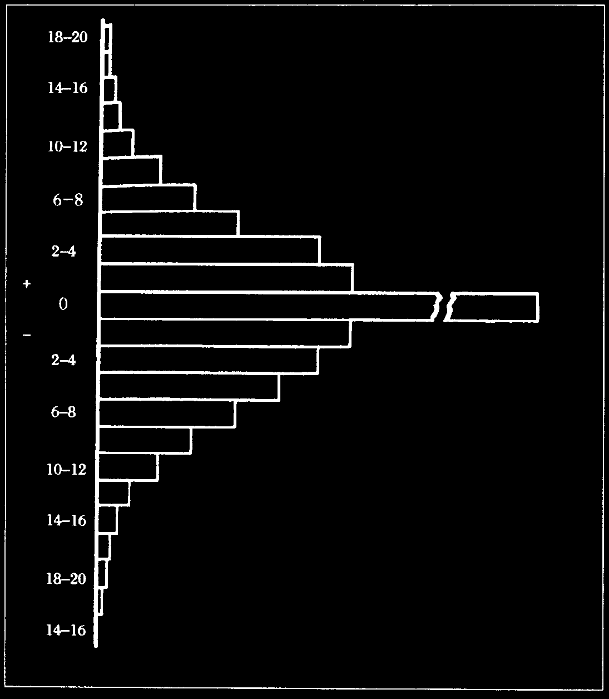
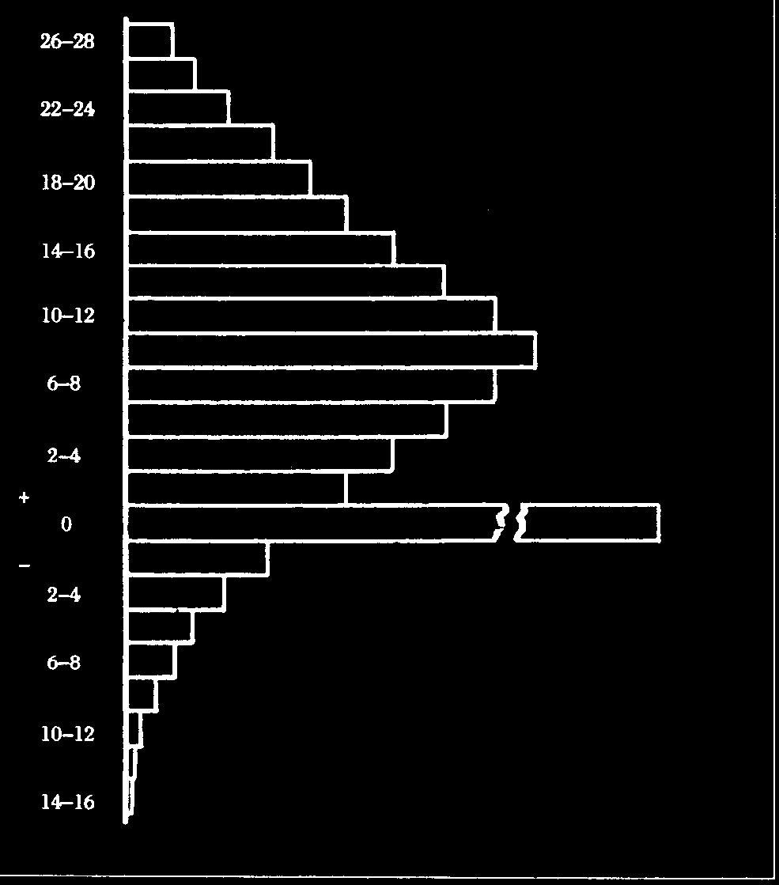

# 第十三章 货币的哪种价值？

从科学的意义上严格地说，并不存在货币的价值十分平稳这样的事情——当然，也不存在别的十全十美的事情。价值是一种关系，是一种等价的比率，或者用杰文斯的话说，是“间接表达一种比例的模式”[^58]，价值只能这样表示：我们对一定数量的一种东西的估价与“等价”的一定数量的其他东西相同。这两种东西彼此互相表示的相对价值可以保持平稳，但除非我们具体指出相对的那个东西，否则，“某个东西的价值保持不变”的命题就没有明确的意义。

我们会习惯性地、不很严谨地说，“啤酒比食用甜菜的价值更稳定一些”（这是我们能够作出具有一定意义的断言的最佳例子），此时我们的意思是说，啤酒与其他各种商品的相对价值或者说在较长时期内的价值或其交换比率，更为平稳一些。而对于一般的商品或服务，我们最关心的通常是它们与货币的关系。当我们用“价值”一词说到货币本身、说货币价值比较平稳的时候，我们的意思是，以它所表示的大多数商品的价格在短时间内不会沿着同一方向大幅度变化，或者说变化很小。

## “一种具有稳定价值的货币”

但有些商品的价格在自由市场上一直在变化。我们有时会感到，尽管很多东西的价格已经变化了，而货币的价值却大致保持平稳；而在有的时候，货币的价格会出现显著的上升或下降，尽管只有少数重要商品的价格在同一方向上发生了变化。那么，在一个各种物品的价格不断变动的世界上，我们可以将什么样的货币称为一种具有稳定价值的货币？

大致说来，下面一点当然是相当明显的：如果一定数量的货币能够买进的大多种品种的商品的数量减少了，而只有少数商品可买进的数量增加了，则该货币总的购买力就下降了。因而，如果可买进数量增加与减少的部分大体平衡，我们也可以合情合理地说，货币对于商品的支配力基本保持平稳。不过，就我们的研究而言，我们当然还需要对“一种具有稳定价值的货币”给出一个更为精确的定义，对于我们有望从这样的货币中得到的好处，也应给予更准确的说明。

## 错误互相抵消

我们已经看到，货币价值的变动会透过其对延迟支付的合同及货币单位作为经济计算和记账之基础的用途发挥影响而产生严重的扰乱作用。如果这两者受到扰乱，个人就不得不就如何应付如下无可回避的事实而作出决策：对于个人来说，大多数物品之价格未来的波动乃是无法预期的（因为价格就是他无法了解的大多数事件的一个信号而已）。由此而导致的风险，只有借助于对未来价格变动的预期进行估计，才能得到最大程度的控制，而且，这种预期的变动应当与当前价格波动的方向一致，且按一定的百分比波动。只有当这个百分比是零，因而大量价格相当僵硬

或迟缓的商品（主要是公用事业价格，但也包括大多数有品牌的商品之价格、通过邮购等类似方式销售）之价格在未来的波动都保持一致的时候，人们才能正确地估计到未来价格变动的中位数。

*(a) 稳定的价格*

*图1 以按所标百分比发生了变动的价格（相较于以前）出售之各种商品的价格总水平*

可以用两张图说明这种情形。如果对货币价值的调控能使各种商品的平均价格在某一水平保持稳定，则人们在安排自己未来的一切活动时必须考虑的未来价格波动的可能情况，体现在图1

中。尽管在这种情况下，个别商品未来的价格也是不确定的——这是市场经济运转过程中无法避免的——但是，在相当长的时间段中，对于整个社会的人来说，不可预见的价格波动的影响，将刚好能够互相抵消。这样的波动至少不会导致人们的预期都出现同一个失误；相反，总的来说，人们能够根据价格波动的连续性（即使不能获得更充分的信息），而作出相当成功的估计。

在单个商品价格紊乱的波动导致所有商品价格总水平上涨的时候，则可能会出现图2所显示的情形。

*(b) 价格上涨*

*图2 以按所标百分比发生了变动的价格（相较于以前）出售之各种商品的价格总水平*

由于单个企业没有办法像预计单个商品价格那样正确地预计全部商品价格波动的中位数，所以，它也无法将自己的经济计算和决策建立在某个已知的中位数之基础上，根据这一中位数，单个商品价格既可能上涨也可能下跌。于是，成功的经济计算，或者说有效的资本和成本会计就成为不可能的了。人们就越来越渴望出现一种记账单位，它的价值与总的价格变动趋势更为紧密地保持一致，这种愿望之迫切，有时甚至会驱使人们将某种不能充当交换媒介的东西当做记账单位。[^59]

## 选择的标准

我们一定不能把货币数量的变化可能会导致出现的这些价格波动的分布向连续统一的一侧单向移动，以及由此导致的预测、计算和记账时的困难，与相对价格的结构之临时性变化混为一谈，尽管后者也同样会导致生产被扭曲的恶果。我们后面必须得考察（第十七章），保持币值的稳定，如何能够有效地阻止生产的这种扭曲，而这种扭曲随后必然会导致经济增长过程的逆转，导致大量投资出现亏损，导致长期失业。我们将论证，这是稳定

的通货的主要好处之一。不过，我们恐怕很难断言货币的使用者会基于这一理由而选择一种具有某种稳定币值的通货。这是他们不大可能认识到的效果，也是他们个人在就使用何种货币的问题作出决策的过程中不大可能考虑得到的——尽管使用某一币值稳定的通货的地区的企业一直保持顺畅运转的事实，可能会吸引其他地区的人们也使用那种通货。个人也不可能靠自己使用某种币值稳定的货币而保护自己不受上述恶果的影响，因为各种商品相对价格的结构用并行的若干种通货来衡量，其实是一样的，因而，只要稳定的通货与不断波动的通货在相当大程度上同时流通，则那些紊乱就是无法避免的。

因而，为什么人们倾向于选择一种用商品来衡量而保持币值稳定的货币，其理由应该是，由于币值稳定能够使不同方向上的失误在总体上相互抵消，从而有助于人们将价格波动的不可避免的不确定性的影响最小化。而如果单个商品价格的偏离集之中位数不是零而是某个未知的量，则不会出现这种抵消效应。即使我们同意，人们会乐于使用的那种稳定的货币就是这样一种货币，这种货币能使他们预计到，他们最感兴趣的那些商品的单个价格——以这种货币来衡量的价格——上涨的可能性跟下跌的可能性一样大，但这也仍然不能告诉我们，大多数人希望看到保持稳定的是哪个价格水平。不同的人或不同的企业感兴趣的显然是不同商品的价格。不同的商品组合的价格总水平，当然会沿着不同的方向变动。

## 会计的功效仍是决定性

人们可能在乍看之下又一次倾向于考虑用零售价格或生活成本来衡量货币，甚至大多数个人消费者会偏爱某种以这些标准来衡量比较稳定的货币，但一种更全面的考虑却使我们似乎不应根据上述指标调整货币以使其具有吸引力。生活成本因地而异，且

会由于不同的经济增长幅度而不断变化。企业当然会偏爱那种被广大地区接受的货币。对于每个企业的经济计算和会计（因而也是对于资源利用的效率）——而这仰赖于价格的总体稳定，而不取决于企业对个别市场的专业化知识——来说，最重要的一点则是广泛交易的那些产品，如原材料、农业部门出产的粮食及某种标准化的工业半制成品的价格。这些产品的价格还有一个优势：它们是在定时营业的市场上交易的，它们的价格会被及时地报道，至少是原材料，其价格尤其敏感，因而，就使人们有可能据此预计价格总水平波动的趋势（这种趋势经常会在这些商品中最早显示出来）。

事实上，直接以保持原材料价格稳定为目标而调控货币发行量，对于消费品价格保持稳定的效果，非常有可能大于直接以后者为目标调控货币量的效果。经验已经显示，在货币量的变化与消费品价格水平的波动之间，存在着一个相当大的滞后期。事实上，这可能意味着，如果货币流通量的调整被迫推迟，直到发行量的过剩或短缺在消费品价格的波动中表现出来时才进行调整，就不可能避免出现非常严重的价格波动了；另一方面，就原材料来说，由于这种时间滞后要短得多，所以，提前发出的预警，应能使人们更及时地采取预防性措施。

靠工资和薪金生活的人可能也会发现，以原材料的平均价格或类似的指标进行集体谈判也较有利，因为这将使得那些收入固定的人能够自动享受工业生产率增长的好处。（不发达国家也会青睐某种能够使原材料的购买力之增长速度超过工业品购买力增长速度的国际性通货——尽管他们仍有可能利用这种机会而继续维持单个原材料价格的稳定。）我认为，不管怎样，这可能是主流的选择，因为用原材料价格衡量能够保持稳定的通货，也许是最有希望成功的办法，借此我们有望得到某种有利于各种经济活动保持稳定的货币。

## 商品批发价格作为跨国货币价值的标准

我的预期是，至少在超过某种民族国家疆域的更大地区范围内，人们会普遍同意以某组商品的批发价格作为他们致力于使之保持稳定的通货的本位。若干银行正是据此调整而使自己的通货广泛流通，它们发行的具有不同名称的通货，但彼此间保持着大体稳定的兑换率，它们会不断地尝试、并调整那个“一篮子”商品的组成，它们努力地使以自己的通货衡量的这些商品的价格保持稳定。[^60] 而这种做法并不会导致流通在该区域内的各种主要通货的相对价值出现大幅度波动。流通着多种通货的各个地区间，当然会有某些通货彼此重合，这些通货的价值主要基于这些商品对于某种生活方式或某些最重要的产业部门的重要性来确定，因而它会因地区不同而出现相对而言更大的变化，但仍将在那些具有同一职业和习俗的人中拥有其自成体系的客户。

---

[^58]: W. S. Jevons [34], p. 11. 也请参见上引书 p. 68: “价值不过是表示两种商品交换的不断变化的比率而已，因而，我们没有任何理由说，东西两天之内具有同样的价值。”——原注

[^59]: 不管我们是使用货币还是使用某种商品作为衡量价格的尺度，标出了受到一段时间内价格相对于上段时期的上涨或下跌之影响的商品的百分比的那张表示价格波动之离散度的曲线，假如是根据对数的数值画出，其形态就是相同的。如果我们使用某种比其他商品价格下跌更多的商品作为标准，则所有的价格变动不仅都会被显示为上涨，而且，不管使用哪种尺度，与使用其他商品作为尺度相比，相对价格上涨的比例都是一样的，比如说，都是有50%的商品的价格出现上涨。我们或许可以得到一条正常出错（高斯式的）曲线——因为我们预计，在任一方向对模型的偏离，都刚好彼此互相抵消，并随着偏离幅度增加，偏离的数量趋于减少——的一般形态曲线图。（大多数价格的变动，都是因为某些商品价格下跌、某些商品价格上涨而导致之需求的变动引起的；这类相对较小的变化比大的变化发生得更频繁一些。）用具有这个意义上的稳定币值的某种货币来衡量，该模型中所表示的商品的价格保持不变，以按照某一确定的百分比而涨跌了的价格进行交易的各自的数量，正好互相扯平。这会使失误最小化，当然未必是指具体的个人，而是指总体上。尽管没有可行的指数可以完全达到我们所设想的目的，但具有近似效果的办法应该是可以找到的。——原注

[^60]: 事实上，竞争可能迫使它们不断地改进技术，最大限度地保持币值稳定，甚至远远超出实际需要。——原注
